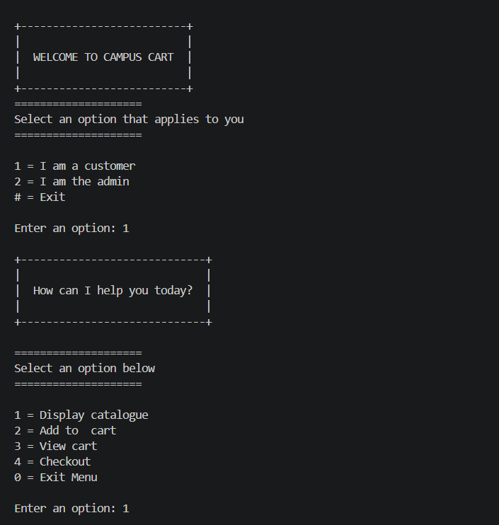
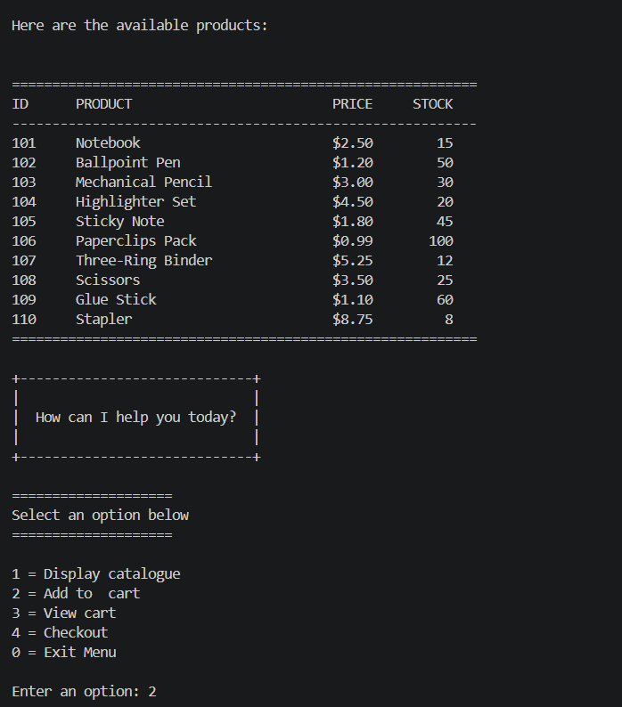
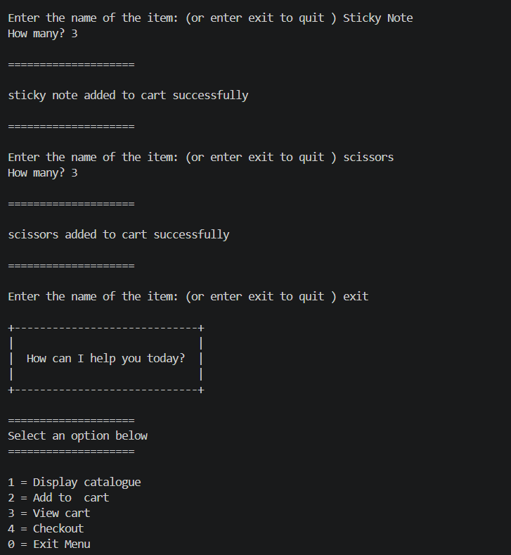
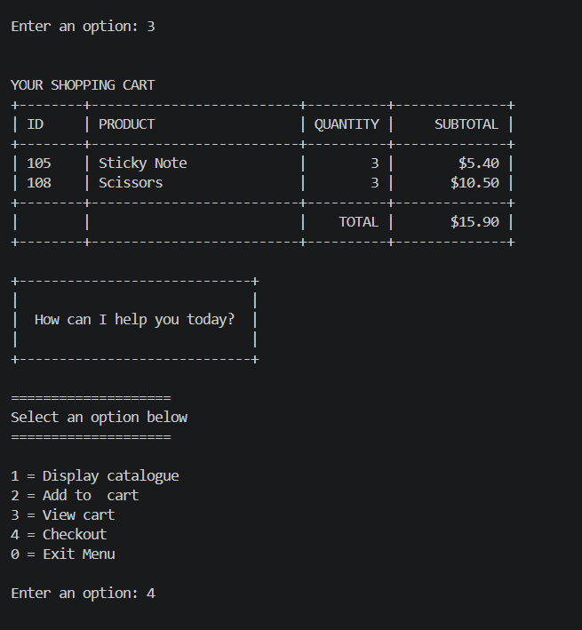
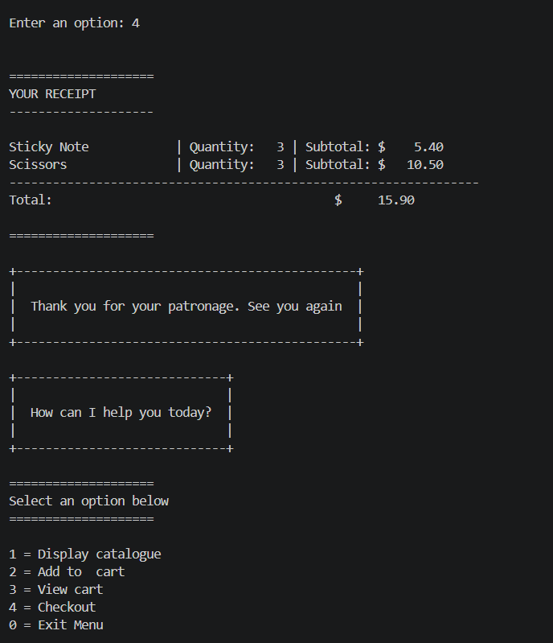

# CAMPUSCART

CampusCart is an interactive command-line shopping and inventory application for campus vendors. It provides separate customer and administrator menus, allowing customers to browse products and complete purchases while administrators maintain the store's inventory.

## Overview

Campus vendors often rely on handwritten stock records and manual checkout calculations. CampusCart demonstrates how a lightweight Python program can bring common sales tasks into one keyboard-driven interface without requiring dedicated point-of-sale hardware.

The current version uses Python variables, conditionals, loops, functions, dictionaries, lists, and formatted terminal output.

## Problem Statement

CampusCart is designed to address several common problems faced by small campus vendors:

- **Manual inventory tracking:** Paper records can become inaccurate, especially during busy periods.
- **Slow checkout:** Manually calculating item totals and discounts can delay customers.
- **Stock-control errors:** Without an immediate stock check, a vendor may attempt to sell more units than are available.
- **Unclear purchase summaries:** Customers benefit from seeing their selected items, quantities, subtotals, and final total in a consistent format.

## Target Audience

- **Student entrepreneurs** operating dorm-based snack shops, stationery stores, clothing thrifts, or printing services.
- **On-campus kiosk operators** managing small coffee carts, juice bars, or stationery stands.
- **Club and society treasurers** selling merchandise, event tickets, or food during campus activities.

## Key Value Proposition

CampusCart provides a simple checkout and inventory workflow in the terminal. Customers can complete a purchase using item names, while administrators can update the product catalogue without editing the inventory dictionary during the running session.

## Current Features

### Customer features

- Display the product catalogue with product IDs, names, prices, and available stock.
- Search for a product by entering its name.
- Add one or more units of a product to the cart.
- Add more units of a product already in the cart.
- Prevent cart quantities from exceeding the available stock.
- View an itemised cart and total.
- Print a receipt during checkout.
- Apply a 10% discount automatically when the cart total is greater than `$20.00`.
- Reduce inventory quantities after checkout.
- Clear the cart after a completed checkout.

### Administrator features

- Display the current inventory.
- Update the price of an existing product.
- Replace the stock quantity of an existing product.
- Add a new product with an ID, name, price, and stock quantity.

## Requirements

- Python 3.12 or later
- A terminal or command prompt
- No third-party packages are required

## ASCII CLI MOCKUP

The mockup below reflects the options available in the current CampusCart program.

```
 +--------------------------------------------------------------+
|                                                              |
|                    WELCOME TO CAMPUS CART                     |
|                                                              |
+--------------------------------------------------------------+

Select an option that applies to you:

    [1] Customer
    [2] Administrator
    [#] Exit

Enter an option: _


================================================================
                         CUSTOMER MENU
================================================================

+--------------------------------------------------------------+
|                    HOW CAN I HELP YOU?                        |
+--------------------------------------------------------------+

    [1] Display catalogue
    [2] Add to cart
    [3] View cart
    [4] Checkout
    [0] Exit menu

Enter an option: 1


================================================================
                       PRODUCT CATALOGUE
================================================================

ID      PRODUCT                         PRICE     STOCK
----------------------------------------------------------
101     Notebook                        $2.50        15
102     Ballpoint Pen                   $1.20        50
103     Mechanical Pencil               $3.00        30
104     Highlighter Set                 $4.50        20
105     Sticky Note                     $1.80        45
106     Paperclips Pack                 $0.99       100
107     Three-Ring Binder               $5.25        12
108     Scissors                        $3.50        25
109     Glue Stick                      $1.10        60
110     Stapler                         $8.75         8
==========================================================


================================================================
                         ADD TO CART
================================================================

Enter the name of the item (or enter "exit" to quit): Notebook
How many? 2

==============================
Notebook added to cart successfully
==============================

Enter the name of the item (or enter "exit" to quit): Stapler
How many? 2

==============================
Stapler added to cart successfully
==============================

Enter the name of the item (or enter "exit" to quit): exit


================================================================
                         VIEW CART
================================================================

YOUR SHOPPING CART

+--------+--------------------------+----------+--------------+
| ID     | PRODUCT                  | QUANTITY |     SUBTOTAL |
+--------+--------------------------+----------+--------------+
| 101    | Notebook                 |        2 |        $5.00 |
| 110    | Stapler                  |        2 |       $17.50 |
+--------+--------------------------+----------+--------------+
|        |                          |    TOTAL |       $22.50 |
+--------+--------------------------+----------+--------------+


================================================================
                           CHECKOUT
================================================================

YOUR RECEIPT
-----------------------------------------------------------------

Notebook               | Quantity:   2 | Subtotal: $    5.00
Stapler                | Quantity:   2 | Subtotal: $   17.50
-----------------------------------------------------------------
Total before discount:                         $     22.50
Discount (10%):                                -$     2.25
-----------------------------------------------------------------
Total after discount:                          $     20.25


+-----------------------------------------------------+
|                                                     |
|    Thank you for your patronage. See you again      |
|                                                     |
+-----------------------------------------------------+

Purchase completed successfully.
Stock quantities have been updated.
Your shopping cart is now empty.


================================================================
                      ADMINISTRATOR MENU
================================================================

Welcome back, Admin. What do you want to do today?

    [1] Display inventory
    [2] Manage inventory
    [0] Exit menu

Enter an option: 2


================================================================
                  INVENTORY MANAGEMENT CENTER
================================================================

    [1] Update product price
    [2] Update product stock
    [3] Add new product
    [0] Return to main menu

Enter an option: _


----------------------------------------------------------------
UPDATE PRODUCT PRICE
----------------------------------------------------------------

Enter the product ID: 101

Current product: Notebook
Current price: $2.50

Enter the new price: $3.00

==============================
Price updated successfully
==============================


----------------------------------------------------------------
UPDATE PRODUCT STOCK
----------------------------------------------------------------

Enter the product ID: 101

Current product: Notebook
Current stock: 13

Enter the new stock: 25

==============================
Stock updated successfully
==============================


----------------------------------------------------------------
ADD A NEW PRODUCT
----------------------------------------------------------------

Enter the new product ID: 111
Enter the product name: Correction Tape
Enter the product price: $2.75
Enter the stock quantity: 20

==============================
Correction Tape added successfully
==============================


================================================================

+--------------------------------------------------------------+
|                                                              |
|                  THANK YOU FOR USING                         |
|                                                              |
|                     C A M P U S C A R T                      |
|                                                              |
+--------------------------------------------------------------+
```

## Flow of a Successful Purchase

### Available Options



### Display Catalogue



### Add to Cart



### View Cart



### Checkout



## Limitations

The current version does not yet provide:

- Permanent database or file storage
- User authentication for the administrator menu
- Removal of individual products from the cart
- Saved or searchable receipt history
- Tax calculation or payment-method processing
- Sales analytics or revenue reports
- Configurable currency or settings

These items are in the works for future development, but they are not part of the present program.

## Future Improvements

- Save inventory and transaction data in JSON, CSV, or a database.
- Add administrator authentication.
- Allow customers to remove items or change quantities before checkout.
- Generate unique receipt numbers and save transaction history.
- Add daily and weekly sales reports.
- Validate quantity input without stopping the program when non-numeric text is entered.
- Support configurable taxes, discounts, and currencies.

## Author

**Oluwatomisin Tomoloju**
